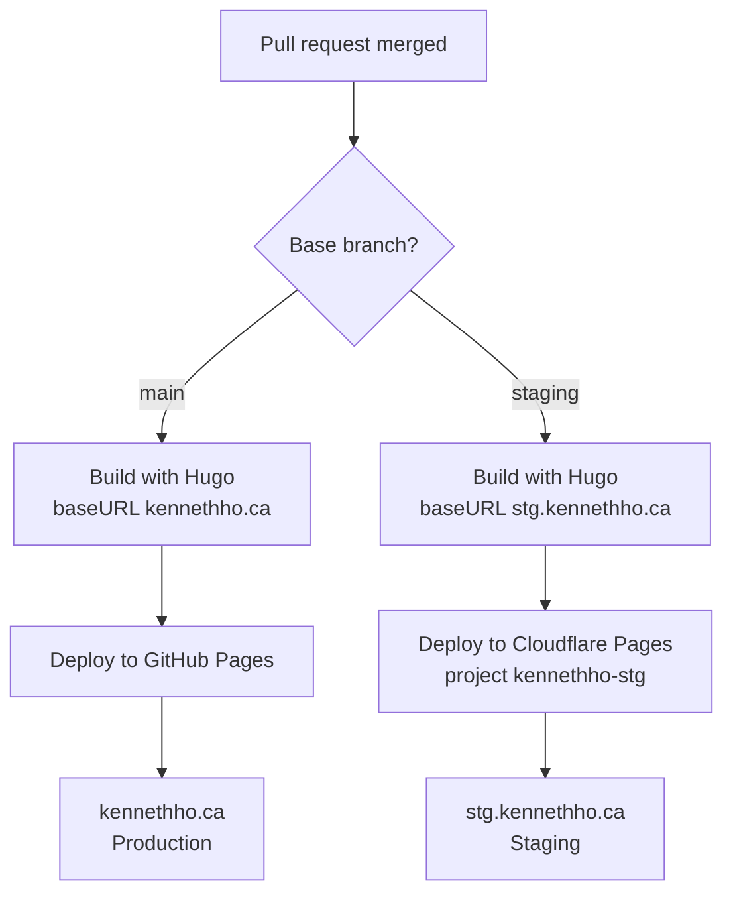

# CI/CD strategy

The site is built once with Hugo in GitHub Actions and deployed to a different
host per branch. The workflow is `.github/workflows/deploy.yml`.

## Branches and targets

| Branch    | Environment | Host             | URL                     |
| --------- | ----------- | ---------------- | ----------------------- |
| `main`    | Production  | GitHub Pages     | `https://kennethho.ca`     |
| `staging` | Staging     | Cloudflare Pages | `https://stg.kennethho.ca` |

Any other branch does not deploy. Open a pull request against `main` or
`staging`; merging it pushes to that branch and triggers its deploy.

## Flow

## How it works

- **Trigger:** A push to `main` or `staging` (including a merged pull request),
  or a manual run from the Actions tab.
- **Build:** One shared `build` job runs Hugo. The `baseURL` is set per branch so
  canonical links, the sitemap, and RSS point at the correct host.
- **Production deploy:** On `main`, the build uploads a Pages artifact and
  `deploy-pages` publishes it to GitHub Pages. A `CNAME` file pins the
  `kennethho.ca` custom domain.
- **Staging deploy:** On `staging`, the build output is deployed to Cloudflare
  Pages with `wrangler-action`. The Cloudflare project `kennethho-stg` is a
  Direct Upload project whose production branch is `staging`, so the deploy is
  served on the `stg.kennethho.ca` custom domain.

Concurrency is grouped per branch, so a staging deploy never cancels or queues
behind a production deploy.

## DNS

Cloudflare is authoritative DNS for `kennethho.ca`.

- `kennethho.ca` (apex) points to GitHub Pages with `A`/`AAAA` records.
- `stg.kennethho.ca` is a `CNAME` that Cloudflare creates and manages when the
  custom domain is attached to the `kennethho-stg` project.

## Related

- Cloudflare Pages setup: [`../how-to/setup/cloudflare-pages.md`](../how-to/setup/cloudflare-pages.md)
- Workflow: [`../../.github/workflows/deploy.yml`](../../.github/workflows/deploy.yml)
