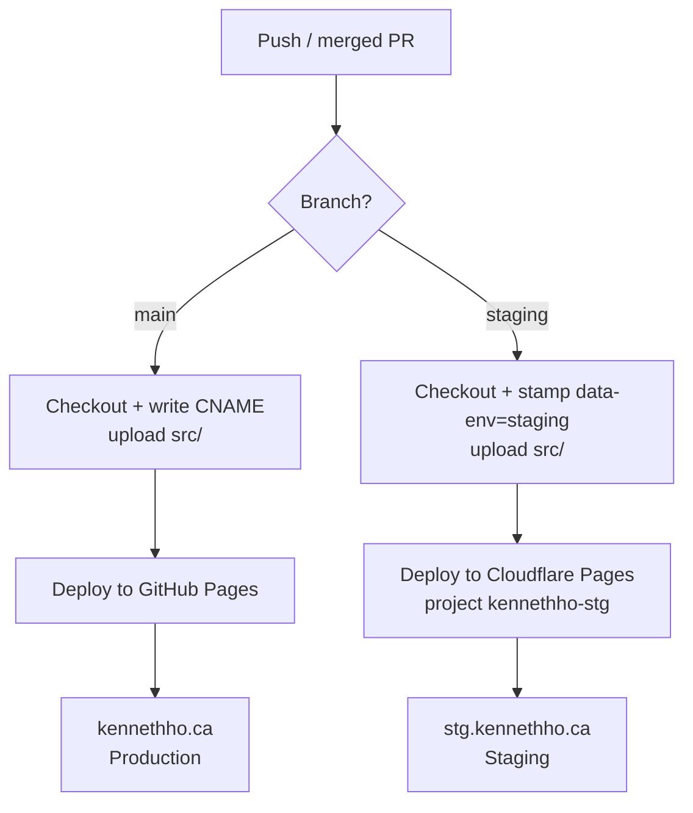

# CI/CD strategy

The site has no build step. GitHub Actions checks out the repository and
uploads `src/` directly to a different host per branch. The workflow is
`.github/workflows/deploy.yml`.

## Branches and targets

| Branch    | Environment | Host             | URL                     |
| --------- | ----------- | ---------------- | ----------------------- |
| `main`    | Production  | GitHub Pages     | `https://kennethho.ca`     |
| `staging` | Staging     | Cloudflare Pages | `https://stg.kennethho.ca` |

Any other branch does not deploy. Open a pull request against `main` or
`staging`; merging it pushes to that branch and triggers its deploy.

## Flow

## How it works

- **Trigger:** A push to `main` or `staging` (including a merged pull request),
  or a manual run from the Actions tab.
- **No build:** Each branch has its own deploy job that checks out the repo and
  uploads `src/` as-is. There's no compile, bundle, or template render step.
- **Production deploy:** On `main`, the job writes a `CNAME` file into `src/`
  for the `kennethho.ca` custom domain, then uploads `src/` as a Pages artifact
  that `deploy-pages` publishes to GitHub Pages.
- **Staging deploy:** On `staging`, the job stamps
  `data-env="staging"` into `src/index.html` before deploying `src/` to
  Cloudflare Pages with `wrangler-action`. The Cloudflare project
  `kennethho-stg` is a Direct Upload project whose production branch is
  `staging`, so the deploy is served on the `stg.kennethho.ca` custom domain.

Concurrency is grouped per branch, so a staging deploy never cancels or queues
behind a production deploy.

### Staging SECRET banner

`src/index.html` ships with `data-env="production"` and a banner that only
renders when `data-env="staging"`. The staging deploy job stamps that
attribute with `sed` before uploading, so the banner appears only on
`stg.kennethho.ca` and never on production.

## DNS

Cloudflare is authoritative DNS for `kennethho.ca`.

- `kennethho.ca` (apex) points to GitHub Pages with `A`/`AAAA` records.
- `stg.kennethho.ca` is a `CNAME` that Cloudflare creates and manages when the
  custom domain is attached to the `kennethho-stg` project.

## Related

- Cloudflare Pages setup: [`../how-to/setup/cloudflare-pages.md`](../how-to/setup/cloudflare-pages.md)
- Workflow: [`../../.github/workflows/deploy.yml`](../../.github/workflows/deploy.yml)
