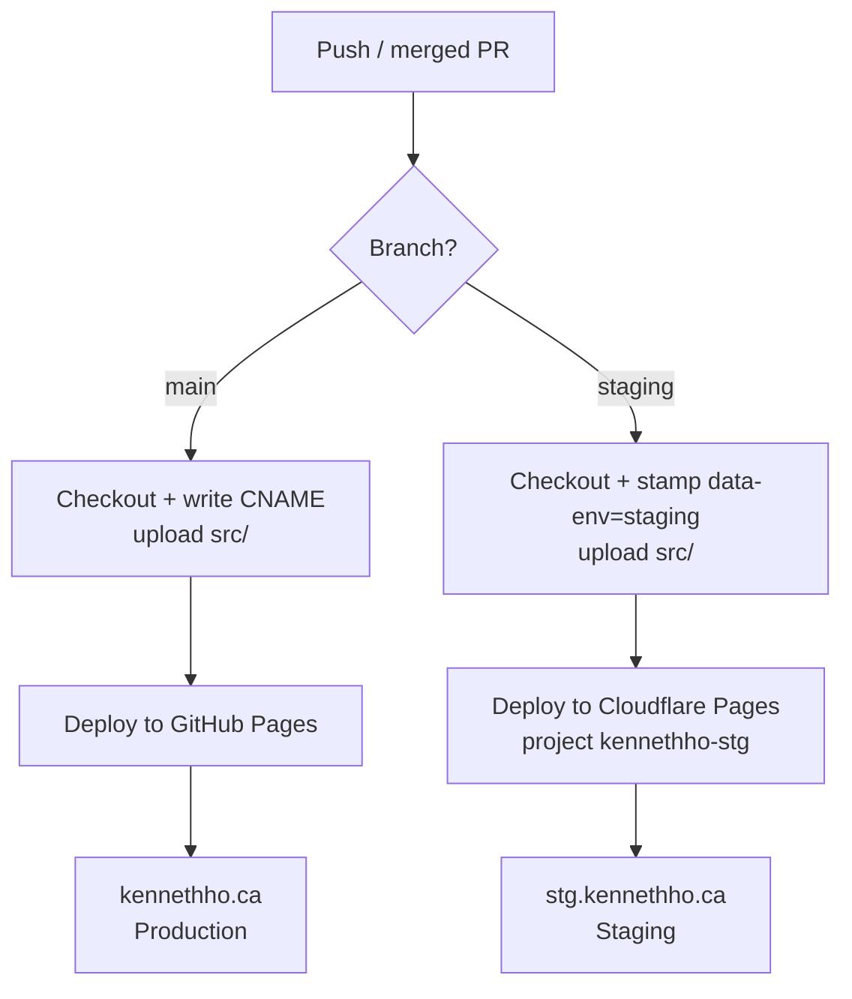

# Astro UXDS Rebuild Implementation Plan

> **For agentic workers:** REQUIRED SUB-SKILL: Use superpowers:subagent-driven-development (recommended) or superpowers:executing-plans to implement this plan task-by-task. Steps use checkbox (`- [ ]`) syntax for tracking.

**Goal:** Replace the Hugo + Blowfish static site with a single-page, zero-build site built from vendored Astro UXDS Web Components that renders with no external dependencies.

**Architecture:** A hand-authored `src/index.html` loads a locally vendored copy of `@astrouxds/astro-web-components` (JS + CSS + Roboto fonts, only the chunks the page uses). Content is the existing linktree (profile, GitHub/LinkedIn, DineSafeViz card) laid out with `rux-*` components over the existing LCARS space backdrop. A SECRET classification banner is present in markup but revealed only when CI stamps the deployed files as `staging`. CI is reduced to "checkout → stamp env → upload `src/`" per branch.

**Tech Stack:** Plain HTML/CSS + Astro UXDS Web Components v8.0.0 (Stencil, framework-agnostic custom elements). No SSG, no bundler, no npm at build time. GitHub Actions → GitHub Pages (prod) / Cloudflare Pages (staging).

**Spec:** `docs/superpowers/specs/2026-08-24-astro-uxds-redesign-design.md`

## Global Constraints

- **Library version:** `@astrouxds/astro-web-components@8.0.0`, pinned. Recorded in `README.md`.
- **Zero external render dependencies:** the rendered page must issue no network requests to any host other than the site's own origin. The only permitted external tag is Umami analytics, which is non-critical (page must render fully with it blocked).
- **No build / no bundler / no npm ci** anywhere in CI. Vendoring is a one-time local file operation.
- **Dark mode only.** No light theme, no theme switcher.
- **All website source under `src/`.** `docs/` stays at repo root.
- **Vendor folder is generated / do-not-edit.** Only `src/vendor/astro/` holds upstream files; keep them byte-for-byte as downloaded.
- **Content parity** with the current site (see Task 5 for exact copy, links, and tags).
- **Custom domain / hosts unchanged:** `main` → GitHub Pages → `https://kennethho.ca`; `staging` → Cloudflare Pages project `kennethho-stg` → `https://stg.kennethho.ca`.
- **Network access:** Task 3 (vendoring) and its font download require outbound network. In this sandbox, `curl`/`wget` may be blocked by default — run those specific download commands with `dangerouslyDisableSandbox: true` (or have the user approve them). All other tasks are offline.
- **Commit style:** end commit messages with the repo's `Co-Authored-By: Claude ...` / `Claude-Session:` trailers as configured.

---

## File Structure

Created:
- `src/index.html` — the entire site (one page).
- `src/styles/site.css` — layout, LCARS backdrop, dark theme application, banner reveal rule.
- `src/styles/fonts.css` — `@font-face` for local Roboto.
- `src/vendor/astro/` — vendored library: `astro-web-components.esm.js`, `astro-web-components.css`, used `p-*.js` chunks, and `fonts/roboto-*.woff2`.
- `src/img/` — avatar, LCARS backdrop, favicons, `site.webmanifest`.
- `src/robots.txt` — static robots (replaces the Hugo-templated one).
- `src/CNAME` — `kennethho.ca` (also written by CI for prod; committed copy keeps intent visible).

Modified:
- `.github/workflows/deploy.yml` — remove the build job; stamp env; upload `src/`.
- `.gitignore` — drop Hugo entries and the stale `*/superpowers` rule.
- `README.md` — new tech stack + vendoring/update instructions.
- `docs/ref/ci-cd.md` — rewrite build/flow sections.

Removed (Hugo machinery):
- `themes/` + `.gitmodules` (Blowfish submodule), `config/`, `content/`, `layouts/`, `archetypes/`, `resources/`, `public/`, `static/`, `.hugo_build.lock`, `.hugo-server.log`.

---

## Task 1: Remove Hugo machinery and scaffold `src/`

**Files:**
- Delete: `themes/`, `.gitmodules`, `config/`, `content/`, `layouts/`, `archetypes/`, `resources/`, `public/`, `static/`, `.hugo_build.lock`, `.hugo-server.log`
- Modify: `.gitignore`
- Create: `src/img/` (populated from old `assets/img` + `static/`), `src/robots.txt`, `src/CNAME`

**Interfaces:**
- Produces: the `src/img/` asset paths used by Task 5 — `src/img/kenough-400x400.webp` (avatar), `src/img/lcars0-1377x1080.webp` (backdrop), `src/img/favicon-32x32.png`, `src/img/favicon-16x16.png`, `src/img/apple-touch-icon.png`, `src/img/android-chrome-192x192.png`, `src/img/android-chrome-512x512.png`, `src/img/favicon.ico`, `src/img/site.webmanifest`.

- [ ] **Step 1: De-init and remove the Blowfish submodule**

```bash
cd /home/sam/SCM/github/im-kenough.github.io
git submodule deinit -f themes/blowfish 2>/dev/null || true
git rm -f .gitmodules 2>/dev/null || true
git rm -rf --cached themes 2>/dev/null || true
rm -rf themes .git/modules/themes
```

- [ ] **Step 2: Remove the remaining Hugo files**

```bash
git rm -r --cached config content layouts archetypes resources static 2>/dev/null || true
rm -rf config content layouts archetypes resources public static
rm -f .hugo_build.lock .hugo-server.log
```

- [ ] **Step 3: Create `src/` and move images in**

```bash
mkdir -p src/img src/styles src/vendor/astro/fonts
git mv assets/img/kenough-400x400.webp src/img/kenough-400x400.webp
git mv assets/img/lcars0-1377x1080.webp src/img/lcars0-1377x1080.webp
# favicons/manifest previously in static/ were deleted above; restore the needed
# ones from git history into src/img/:
for f in favicon-32x32.png favicon-16x16.png apple-touch-icon.png \
         android-chrome-192x192.png android-chrome-512x512.png favicon.ico \
         site.webmanifest; do
  git show HEAD:static/$f > src/img/$f
done
rm -rf assets
```

- [ ] **Step 4: Fix `site.webmanifest` icon paths and colors for the new layout**

Overwrite `src/img/site.webmanifest` with (icons now live under `/img/`, dark theme color):

```json
{"name":"Kenneth Ho","short_name":"Kenneth Ho","icons":[{"src":"/img/android-chrome-192x192.png","sizes":"192x192","type":"image/png"},{"src":"/img/android-chrome-512x512.png","sizes":"512x512","type":"image/png"}],"theme_color":"#000000","background_color":"#000000","display":"standalone"}
```

- [ ] **Step 5: Create `src/robots.txt`** (static; preserves the previous disallow-all-except-Googlebot intent, no Hugo sitemap template)

```
User-agent: *
Disallow: /

User-agent: Googlebot
Disallow:
```

- [ ] **Step 6: Create `src/CNAME`**

```
kennethho.ca
```

- [ ] **Step 7: Rewrite `.gitignore`** (drop Hugo + stale `*/superpowers`; vendor is committed)

```gitignore
# System specific
.DS_Store
Thumbs.db

# Editor/temp files
*.swp
*.swo
*~
*.bak
*.old
*.tmp

# IDE
.vscode/
.idea/

# Local scratch (never committed)
/scratch/
```

- [ ] **Step 8: Verify the Hugo machinery is gone and `src/` is scaffolded**

Run:
```bash
ls themes config content layouts 2>&1 | sort -u   # expect: "No such file or directory"
ls src src/img && cat src/CNAME
git check-ignore docs/superpowers/plans/2026-08-24-astro-uxds-redesign.md || echo "OK: plan not ignored"
```
Expected: Hugo dirs absent; `src/img/` contains the avatar, backdrop, favicons and `site.webmanifest`; `src/CNAME` prints `kennethho.ca`; plan file is no longer ignored (`OK: plan not ignored`).

- [ ] **Step 9: Commit**

```bash
git add -A
git commit -m "refactor: remove Hugo machinery, scaffold src/ and move assets"
```

---

## Task 2: Local dev-serve helper (offline verification harness)

A tiny, committed helper so every later task can verify "renders offline" the same way. No framework, no dependency — just Python's stdlib server plus a documented manual check. This task exists so the render/network checks in Tasks 3–5 are repeatable.

**Files:**
- Create: `docs/how-to/operations/local-preview.md`

**Interfaces:**
- Produces: the documented command `python3 -m http.server -d src 8000` serving the site at `http://localhost:8000`, used as the verification harness in later tasks.

- [ ] **Step 1: Write `docs/how-to/operations/local-preview.md`**

```markdown
# Local preview

The site is static — no build. Serve the `src/` folder directly:

    python3 -m http.server -d src 8000

Then open <http://localhost:8000>.

## Verifying zero external dependencies

With the page open, check the browser DevTools Network tab (or the
chrome-devtools MCP `list_network_requests`). Every request must go to
`localhost` except the optional Umami analytics tag (`cloud.umami.is`).
Blocking Umami must not change how the page renders.

## Verifying the SECRET banner

The banner is gated on the `<html data-env="...">` attribute:
- `data-env="production"` (default in the committed file): no banner.
- `data-env="staging"`: SECRET banners at top and bottom.

To preview the staging state locally, temporarily edit the attribute to
`staging` (CI does this substitution automatically on the staging branch —
do not commit the change).
```

- [ ] **Step 2: Verify the server runs**

Run:
```bash
timeout 2 python3 -m http.server -d src 8000 & sleep 1; curl -s -o /dev/null -w "%{http_code}\n" http://localhost:8000/ ; kill %1 2>/dev/null
```
Expected: prints `200` (an empty-ish dir is fine at this stage; `index.html` arrives in Task 5). If `curl` is sandbox-blocked for localhost, use the chrome-devtools MCP `navigate_page` to `http://localhost:8000/` instead and confirm it loads.

- [ ] **Step 3: Commit**

```bash
git add docs/how-to/operations/local-preview.md
git commit -m "doc: add local preview + offline-verification how-to"
```

---

## Task 3: Vendor Astro UXDS v8.0.0 (used chunks only) + Roboto fonts

**Requires network** for the two download steps — run them with `dangerouslyDisableSandbox: true` or ask the user to approve. Everything is pinned to v8.0.0.

**Files:**
- Create: `src/vendor/astro/astro-web-components.esm.js`, `src/vendor/astro/astro-web-components.css`, the used `src/vendor/astro/p-*.js` chunks, `src/vendor/astro/fonts/roboto-*.woff2`
- Create: `src/styles/fonts.css`
- Scratch (never committed): `scratch/awc-full/`

**Interfaces:**
- Consumes: nothing from prior tasks.
- Produces: the vendored entry `vendor/astro/astro-web-components.esm.js` (loaded as a module by Task 5's `index.html`), `vendor/astro/astro-web-components.css` (linked by Task 5), and `src/styles/fonts.css` defining `@font-face` families for Roboto weights 300/400/500/700 at local `vendor/astro/fonts/` paths.

- [ ] **Step 1: Download and extract the full package to scratch** (network)

```bash
mkdir -p scratch
curl -sL https://registry.npmjs.org/@astrouxds/astro-web-components/-/astro-web-components-8.0.0.tgz -o scratch/awc.tgz
mkdir -p scratch/awc-full
tar -xzf scratch/awc.tgz -C scratch/awc-full --strip-components=1
ls scratch/awc-full/dist/astro-web-components/astro-web-components.esm.js \
   scratch/awc-full/dist/astro-web-components/astro-web-components.css
```
Expected: both paths listed (the extracted dist exists).

- [ ] **Step 2: Write a probe page that exercises every component the site uses**

Create `scratch/probe.html` referencing the FULL vendored copy, so the loader fetches exactly the chunks our components need:

```html
<!doctype html>
<html lang="en">
<head>
  <meta charset="utf-8" />
  <link rel="stylesheet" href="/dist/astro-web-components/astro-web-components.css" />
  <script type="module" src="/dist/astro-web-components/astro-web-components.esm.js"></script>
</head>
<body>
  <!-- Every rux-* element the real page will use must appear here -->
  <rux-classification-marking classification="secret"></rux-classification-marking>
  <rux-card>
    <div slot="header">Probe</div>
    <rux-button>Primary</rux-button>
    <rux-button secondary>Secondary</rux-button>
    <rux-tag>Tag</rux-tag>
  </rux-card>
  <rux-classification-marking classification="secret"></rux-classification-marking>
</body>
</html>
```

Note: the probe covers every `rux-*` element the real page uses — `rux-classification-marking`, `rux-card`, `rux-button`, `rux-tag`. No `rux-icon` — brand logos in the real page are inline SVG, so no icon-asset fetching. If a later design change adds a `rux-*` element, add it here and re-run this task.

- [ ] **Step 3: Serve the full copy and capture the requested chunk files**

```bash
python3 -m http.server -d scratch/awc-full 8001 &
```
Then, using the chrome-devtools MCP:
1. `navigate_page` → `http://localhost:8001/probe.html`
2. `wait_for` the components to render (e.g. wait for text "Secondary").
3. `list_network_requests` → collect every request URL under `/dist/astro-web-components/` (the `.esm.js`, all `p-*.js`, and any other asset such as an `.svg` or `.woff2`).

Kill the server when done: `kill %1`.

Record the captured file list (relative to `/dist/astro-web-components/`) — this is the exact self-contained set.

- [ ] **Step 4: Copy only the captured files into `src/vendor/astro/`**

For each captured relative path `REL` (preserving any subdirectory such as `assets/...`):

```bash
mkdir -p "src/vendor/astro/$(dirname REL)"
cp "scratch/awc-full/dist/astro-web-components/REL" "src/vendor/astro/REL"
```

Always include `astro-web-components.esm.js` and `astro-web-components.css` even if a capture missed them. Expected result: ~15–30 files in `src/vendor/astro/`.

- [ ] **Step 5: Download self-hosted Roboto (300/400/500/700, latin) into `src/vendor/astro/fonts/`** (network)

```bash
curl -sL "https://gwfh.mranftl.com/api/fonts/roboto?download=zip&subsets=latin&variants=300,regular,500,700&formats=woff2" -o scratch/roboto.zip
unzip -o scratch/roboto.zip -d src/vendor/astro/fonts/
ls src/vendor/astro/fonts/
```
Expected: four `.woff2` files (weights 300, regular=400, 500, 700). Note their exact filenames for the next step.

- [ ] **Step 6: Write `src/styles/fonts.css`** (adjust filenames to match Step 5 output)

```css
/* Self-hosted Roboto — replaces Astro UXDS's default Google Fonts link. */
@font-face {
  font-family: "Roboto"; font-style: normal; font-weight: 300; font-display: swap;
  src: url("../vendor/astro/fonts/roboto-v30-latin-300.woff2") format("woff2");
}
@font-face {
  font-family: "Roboto"; font-style: normal; font-weight: 400; font-display: swap;
  src: url("../vendor/astro/fonts/roboto-v30-latin-regular.woff2") format("woff2");
}
@font-face {
  font-family: "Roboto"; font-style: normal; font-weight: 500; font-display: swap;
  src: url("../vendor/astro/fonts/roboto-v30-latin-500.woff2") format("woff2");
}
@font-face {
  font-family: "Roboto"; font-style: normal; font-weight: 700; font-display: swap;
  src: url("../vendor/astro/fonts/roboto-v30-latin-700.woff2") format("woff2");
}
```

- [ ] **Step 7: Determine the dark-theme mechanism from the vendored CSS**

Run:
```bash
grep -oE '(light-theme|dark-theme|prefers-color-scheme|:root)' src/vendor/astro/astro-web-components.css | sort | uniq -c
```
Record how Astro selects the dark palette (a `.dark-theme`/`.light-theme` class on an ancestor, a `data-theme` attribute, or dark-by-default at `:root`). Task 5 applies whatever this shows to force the dark theme. Expected: output identifies the selector; note it for Task 5.

- [ ] **Step 8: Verify the vendored bundle renders offline with zero external requests**

Serve `scratch/awc-full`'s probe against the NEW `src/vendor` copy: create `src/__probe.html` (temporary) identical to `scratch/probe.html` but with hrefs `vendor/astro/astro-web-components.css` and `vendor/astro/astro-web-components.esm.js`. Serve `src/` (`python3 -m http.server -d src 8000`), navigate the chrome-devtools MCP to `http://localhost:8000/__probe.html`, then `list_network_requests`.

Expected: components render; **every** request resolves 200 and targets `localhost` only; no request to `jsdelivr`, `googleapis`, `gstatic`, or any non-local host; no 404s. Then delete the probe: `rm src/__probe.html`.

- [ ] **Step 9: Commit** (scratch stays ignored)

```bash
git add src/vendor/astro src/styles/fonts.css
git commit -m "feat: vendor Astro UXDS 8.0.0 (used chunks) and self-hosted Roboto"
```

---

## Task 4: Site styles (`src/styles/site.css`) — layout, backdrop, dark theme, banner reveal

**Files:**
- Create: `src/styles/site.css`

**Interfaces:**
- Consumes: the dark-theme selector recorded in Task 3 Step 7; the backdrop image `img/lcars0-1377x1080.webp`.
- Produces: the class/attribute contract Task 5's HTML must match — page background via `body`, a centered `.wrap` container, `.banner-marking` elements hidden unless `:root[data-env="staging"]`, and a `.social` button row.

- [ ] **Step 1: Write `src/styles/site.css`**

```css
/* Layout + LCARS backdrop over Astro UXDS tokens. Dark mode only. */
html, body { margin: 0; height: 100%; }
body {
  min-height: 100%;
  font-family: "Roboto", system-ui, sans-serif;
  color: #fff;
  background: #000 url("../img/lcars0-1377x1080.webp") center / cover no-repeat fixed;
}
/* Readability scrim so cards sit on the busy backdrop. */
body::before {
  content: ""; position: fixed; inset: 0;
  background: rgba(0, 0, 0, 0.55); z-index: 0;
}
.wrap {
  position: relative; z-index: 1;
  max-width: 34rem; margin: 0 auto; padding: 3rem 1.25rem;
  display: flex; flex-direction: column; gap: 1.5rem; align-items: center;
}
.avatar {
  width: 128px; height: 128px; border-radius: 9999px;
  object-fit: cover; border: 2px solid rgba(255,255,255,0.25);
}
.identity { text-align: center; }
.identity h1 { margin: 0.5rem 0 0.25rem; font-size: 1.75rem; font-weight: 700; }
.identity p  { margin: 0; font-weight: 300; opacity: 0.85; line-height: 1.4; }
.social { display: flex; flex-wrap: wrap; gap: 0.75rem; justify-content: center; }
.social svg { width: 1.1em; height: 1.1em; vertical-align: -0.15em; margin-inline-end: 0.4em; }
.tags { display: flex; flex-wrap: wrap; gap: 0.5rem; margin: 0.75rem 0 1rem; }
rux-card { width: 100%; }

/* SECRET banner: present in markup, revealed only when CI stamps staging. */
.banner-marking { display: none; }
:root[data-env="staging"] .banner-marking { display: block; }
:root[data-env="staging"] .banner-top {
  position: sticky; top: 0; z-index: 2;
}
:root[data-env="staging"] .banner-bottom {
  position: sticky; bottom: 0; z-index: 2;
}
```

If Task 3 Step 7 found the dark palette needs a class/attribute (e.g. `.dark-theme` on `<body>` or `data-theme="dark"` on `<html>`), no CSS change is needed here — Task 5 sets it on the element. If it found the tokens only apply under a selector this file controls, add that selector here.

- [ ] **Step 2: Verify the reveal rule logic (static check)**

Run:
```bash
grep -n 'data-env="staging"' src/styles/site.css && grep -n '.banner-marking { display: none' src/styles/site.css
```
Expected: both matches present — banners default hidden, shown only under staging.

- [ ] **Step 3: Commit**

```bash
git add src/styles/site.css
git commit -m "feat: add site styles, LCARS backdrop and banner reveal rule"
```

---

## Task 5: The page (`src/index.html`) — content, components, banner markup, head

**Files:**
- Create: `src/index.html`

**Interfaces:**
- Consumes: `styles/fonts.css`, `styles/site.css`, `vendor/astro/astro-web-components.css`, `vendor/astro/astro-web-components.esm.js`, `img/kenough-400x400.webp`, the `.wrap`/`.banner-marking`/`.social`/`.tags` contract from Task 4, and the dark-theme mechanism from Task 3 Step 7.
- Produces: the deployable landing page. The literal string `data-env="production"` on the `<html>` element (the exact substitution target for Task 6's CI stamp).

- [ ] **Step 1: Write `src/index.html`**

Use the dark-theme mechanism recorded in Task 3 Step 7. The example below assumes Astro is dark-by-default and additionally sets `data-theme="dark"` defensively; adjust to the real selector (e.g. add `class="dark-theme"` to `<body>` if that is what the vendored CSS uses).

```html
<!doctype html>
<html lang="en" data-env="production" data-theme="dark">
<head>
  <meta charset="utf-8" />
  <meta name="viewport" content="width=device-width, initial-scale=1.0" />
  <title>Kenneth Ho</title>
  <meta name="description" content="Cloud Systems Administrator and DevOps Analyst with 10+ years of experience keeping mission-critical systems running." />
  <meta name="theme-color" content="#000000" />
  <link rel="canonical" href="https://kennethho.ca/" />

  <link rel="icon" type="image/png" sizes="32x32" href="/img/favicon-32x32.png" />
  <link rel="icon" type="image/png" sizes="16x16" href="/img/favicon-16x16.png" />
  <link rel="apple-touch-icon" sizes="180x180" href="/img/apple-touch-icon.png" />
  <link rel="icon" href="/img/favicon.ico" sizes="any" />
  <link rel="manifest" href="/img/site.webmanifest" />

  <link rel="stylesheet" href="/vendor/astro/astro-web-components.css" />
  <link rel="stylesheet" href="/styles/fonts.css" />
  <link rel="stylesheet" href="/styles/site.css" />
  <script type="module" src="/vendor/astro/astro-web-components.esm.js"></script>
</head>
<body>
  <!-- SECRET banner: hidden unless CI stamps data-env="staging" -->
  <rux-classification-marking classification="secret" class="banner-marking banner-top"></rux-classification-marking>

  <main class="wrap">
    

    <div class="identity">
      <h1>Kenneth Ho</h1>
      <p>Cloud Systems Administrator | DevOps Analyst<br />
         10+ yrs keeping mission-critical systems running</p>
    </div>

    <div class="social">
      <rux-button secondary onclick="window.open('https://github.com/im-kenough','_blank','noopener')">
        <svg viewBox="0 0 24 24" fill="currentColor" aria-hidden="true"><path d="M12 .5C5.73.5.5 5.73.5 12a11.5 11.5 0 0 0 7.86 10.92c.58.1.79-.25.79-.56v-2c-3.2.7-3.88-1.37-3.88-1.37-.53-1.34-1.3-1.7-1.3-1.7-1.06-.72.08-.71.08-.71 1.17.08 1.79 1.2 1.79 1.2 1.04 1.79 2.73 1.27 3.4.97.1-.75.4-1.27.73-1.56-2.55-.29-5.23-1.27-5.23-5.67 0-1.25.45-2.28 1.19-3.08-.12-.29-.52-1.46.11-3.05 0 0 .97-.31 3.18 1.18a11 11 0 0 1 5.8 0c2.2-1.49 3.17-1.18 3.17-1.18.63 1.59.23 2.76.11 3.05.74.8 1.19 1.83 1.19 3.08 0 4.41-2.69 5.38-5.25 5.66.41.36.78 1.06.78 2.14v3.17c0 .31.21.67.8.56A11.5 11.5 0 0 0 23.5 12C23.5 5.73 18.27.5 12 .5Z"/></svg>
        GitHub
      </rux-button>
      <rux-button secondary onclick="window.open('https://www.linkedin.com/in/kenneth-yyz','_blank','noopener')">
        <svg viewBox="0 0 24 24" fill="currentColor" aria-hidden="true"><path d="M20.45 20.45h-3.56v-5.57c0-1.33-.03-3.04-1.85-3.04-1.85 0-2.14 1.45-2.14 2.94v5.67H9.35V9h3.41v1.56h.05c.48-.9 1.64-1.85 3.38-1.85 3.6 0 4.27 2.37 4.27 5.46v6.28ZM5.34 7.43a2.07 2.07 0 1 1 0-4.14 2.07 2.07 0 0 1 0 4.14ZM7.12 20.45H3.55V9h3.57v11.45ZM22.22 0H1.77C.8 0 0 .78 0 1.75v20.5C0 23.22.8 24 1.77 24h20.45c.98 0 1.78-.78 1.78-1.75V1.75C24 .78 23.2 0 22.22 0Z"/></svg>
        LinkedIn
      </rux-button>
    </div>

    <rux-card>
      <div slot="header">DineSafeViz</div>
      <p>A containerized web app that visualizes 26 years of Toronto Public
         Health DineSafe food-inspection data.</p>
      <div class="tags">
        <rux-tag>Terraform</rux-tag>
        <rux-tag>Ansible</rux-tag>
        <rux-tag>Docker</rux-tag>
        <rux-tag>PostgreSQL</rux-tag>
      </div>
      <rux-button slot="footer"
        onclick="window.open('https://github.com/im-kenough/DineSafeViz','_blank','noopener')">
        View DineSafeViz on GitHub
      </rux-button>
    </rux-card>
  </main>

  <rux-classification-marking classification="secret" class="banner-marking banner-bottom"></rux-classification-marking>

  <!-- Umami web analytics (non-critical; page renders fully without it) -->
  <script defer src="https://cloud.umami.is/script.js" data-website-id="11bfaafe-2cac-4452-9444-fce6e771a76a"></script>
</body>
</html>
```

Notes for the implementer:
- `rux-card` slot names (`header`/`footer`) and `rux-tag`/`rux-button` attributes must match v8.0.0. If a slot/attribute differs in the vendored `readme`/CSS, adjust the markup to the real API (check `scratch/awc-full/dist/collection/components/rux-card/readme.md` etc.).
- If Task 3's probe did not already include `rux-tag`, add `<rux-tag>` to the probe and re-run Task 3 so its chunk is vendored — otherwise the tags won't render offline. (Recommended: ensure `rux-tag` is in the probe in Task 3 Step 2.)

- [ ] **Step 2: Verify the page renders offline in the production state**

Serve and inspect with the chrome-devtools MCP:
```bash
python3 -m http.server -d src 8000 &
```
- `navigate_page` → `http://localhost:8000/`
- `wait_for` text "DineSafeViz"
- `take_screenshot` (visually confirm: avatar, name, headline, two social buttons, project card with 4 tags + button, LCARS backdrop, dark theme).
- `list_network_requests`: confirm all non-`localhost` requests are ONLY `cloud.umami.is`; no 404s; no `jsdelivr`/`googleapis`/`gstatic`.
- Confirm NO SECRET banner is visible (production state).

Kill server: `kill %1`.

Expected: renders correctly, banner absent, zero external render dependencies.

- [ ] **Step 3: Verify the staging state shows the banner**

Temporarily set the env to staging and re-check (do not commit this edit):
```bash
sed -i 's/data-env="production"/data-env="staging"/' src/index.html
python3 -m http.server -d src 8000 &
```
- `navigate_page` → `http://localhost:8000/`, `take_screenshot`.
- Confirm a red **SECRET** banner appears at the top AND bottom.
Revert:
```bash
kill %1
sed -i 's/data-env="staging"/data-env="production"/' src/index.html
```
Expected: banners visible in staging state; file restored to `production`.

- [ ] **Step 4: Commit**

```bash
git add src/index.html
git commit -m "feat: build landing page with Astro UXDS components over LCARS backdrop"
```

---

## Task 6: Rewrite the deploy workflow (drop build, stamp env per branch)

**Files:**
- Modify: `.github/workflows/deploy.yml` (full rewrite)

**Interfaces:**
- Consumes: `src/index.html` containing `data-env="production"`; `src/CNAME`.
- Produces: per-branch deploys — `main` → GitHub Pages (`src/` uploaded, `data-env` left `production`); `staging` → Cloudflare Pages project `kennethho-stg` (`data-env` stamped `staging`).

- [ ] **Step 1: Overwrite `.github/workflows/deploy.yml`**

```yaml
# Deploys the static site per-branch (no build step):
#   main    -> GitHub Pages      (production, https://kennethho.ca)
#   staging -> Cloudflare Pages  (staging,    https://stg.kennethho.ca)
name: deploy site

on:
  push:
    branches: [main, staging]
  workflow_dispatch:

permissions:
  contents: read
  pages: write
  id-token: write

concurrency:
  group: "pages-${{ github.ref }}"
  cancel-in-progress: false

defaults:
  run:
    shell: bash

jobs:
  # Production -> GitHub Pages
  deploy-production:
    if: github.ref == 'refs/heads/main'
    runs-on: ubuntu-latest
    environment:
      name: github-pages
      url: ${{ steps.deployment.outputs.page_url }}
    steps:
      - uses: actions/checkout@v7

      # Custom domain marker for GitHub Pages.
      - name: Write CNAME
        run: echo "kennethho.ca" > src/CNAME

      - name: Configure Pages
        uses: actions/configure-pages@v6

      - name: Upload site
        uses: actions/upload-pages-artifact@v5
        with:
          path: ./src

      - name: Deploy to GitHub Pages
        id: deployment
        uses: actions/deploy-pages@v5

  # Staging -> Cloudflare Pages (Direct Upload via Wrangler)
  deploy-staging:
    if: github.ref == 'refs/heads/staging'
    runs-on: ubuntu-latest
    steps:
      - uses: actions/checkout@v7

      # Stamp the staging environment so the SECRET classification banner shows.
      - name: Stamp staging env
        run: sed -i 's/data-env="production"/data-env="staging"/' src/index.html

      # --branch=staging matches the Cloudflare project's PRODUCTION branch so
      # this deploy is served on the stg.kennethho.ca custom domain.
      - name: Deploy to Cloudflare Pages
        uses: cloudflare/wrangler-action@v4
        with:
          apiToken: ${{ secrets.CLOUDFLARE_API_TOKEN }}
          accountId: ${{ secrets.CLOUDFLARE_ACCOUNT_ID }}
          command: pages deploy ./src --project-name=kennethho-stg --branch=staging
```

- [ ] **Step 2: Verify the workflow is valid and the stamp works**

Run:
```bash
python3 -c "import yaml,sys; yaml.safe_load(open('.github/workflows/deploy.yml')); print('YAML OK')"
# Prove the stamp substitution matches the real file:
grep -c 'data-env="production"' src/index.html   # expect 1
tmp=$(mktemp); cp src/index.html "$tmp"; sed -i 's/data-env="production"/data-env="staging"/' "$tmp"; grep -c 'data-env="staging"' "$tmp"; rm "$tmp"   # expect 1
```
Expected: `YAML OK`, then `1`, then `1` — the stamp target exists and substitution works. (If `actionlint` is installed, also run it and expect no errors.)

- [ ] **Step 3: Commit**

```bash
git add .github/workflows/deploy.yml
git commit -m "ci: replace Hugo build with per-branch static deploy + staging env stamp"
```

---

## Task 7: Docs and README

**Files:**
- Modify: `docs/ref/ci-cd.md`, `README.md`

**Interfaces:**
- Consumes: the final workflow and vendoring procedure.
- Produces: accurate docs; no remaining references to Hugo/Blowfish as the current stack.

- [ ] **Step 1: Rewrite the build/flow sections of `docs/ref/ci-cd.md`**

Replace the "Flow" and "How it works" build descriptions so they describe: no build step; per-branch checkout → (staging: stamp `data-env`) → upload `src/`. Update the mermaid diagram nodes from "Build with Hugo" to "Upload src/ (no build)". Keep the Branches/targets table, DNS, and Related sections. Update the mermaid to:



Add a short subsection noting the SECRET banner is enabled on staging via the `data-env` stamp.

- [ ] **Step 2: Rewrite `README.md`** for the new stack

Replace the Hugo/Blowfish "Project Overview" and "Tech Stack" with: static single-page site, Astro UXDS Web Components (vendored, `@astrouxds/astro-web-components@8.0.0`), no build step, GitHub Pages / Cloudflare Pages. Keep the Features/analytics/security sections that still apply (drop Google Analytics — already removed; keep Umami + Cloudflare). Add an "Updating the vendored components" subsection:

```markdown
## Updating the vendored UI library

Components are pinned at `@astrouxds/astro-web-components@8.0.0`, vendored under
`src/vendor/astro/` (only the chunks the page uses). To update: bump the version,
re-run the vendoring procedure in
`docs/superpowers/plans/2026-08-24-astro-uxds-redesign.md` (Task 3), and commit
the refreshed `src/vendor/astro/`.
```

- [ ] **Step 3: Verify no stale Hugo references remain in current-stack docs**

Run:
```bash
grep -rn -i "hugo\|blowfish" README.md docs/ref/ci-cd.md || echo "OK: no stale references"
```
Expected: `OK: no stale references` (historical mentions elsewhere are fine; these two files describe the current stack and must be clean).

- [ ] **Step 4: Commit**

```bash
git add README.md docs/ref/ci-cd.md
git commit -m "doc: update README and CI/CD docs for the Astro UXDS static site"
```

---

## Task 8: Final end-to-end verification

**Files:** none (verification only).

- [ ] **Step 1: Full offline render check (production state)**

```bash
python3 -m http.server -d src 8000 &
```
Via chrome-devtools MCP: `navigate_page` → `http://localhost:8000/`, `wait_for` "DineSafeViz", `take_screenshot`, `list_network_requests`.
Expected: correct layout; the ONLY non-localhost request is `cloud.umami.is`; no 404s; no banner.

- [ ] **Step 2: Umami-blocked render check**

Re-load with network blocking for `cloud.umami.is` (chrome-devtools MCP `emulate`/route blocking, or simply confirm from Step 1 that the page's layout does not depend on the Umami response).
Expected: identical rendering — proves analytics is non-critical.

- [ ] **Step 3: Staging banner check**

```bash
sed -i 's/data-env="production"/data-env="staging"/' src/index.html
```
Reload, `take_screenshot`, confirm top+bottom SECRET banners. Then revert and confirm clean tree:
```bash
sed -i 's/data-env="staging"/data-env="production"/' src/index.html
kill %1
git status --porcelain   # expect empty
```
Expected: banners present in staging; working tree clean after revert.

- [ ] **Step 4: Confirm scratch is gone and nothing stray is tracked**

```bash
rm -rf scratch
git status --porcelain            # expect empty
git ls-files | grep -i "hugo\|themes/blowfish" || echo "OK: no Hugo files tracked"
```
Expected: clean tree; `OK: no Hugo files tracked`.

- [ ] **Step 5: Summarize and hand off** (open a PR against `main` only when the user asks)

Report: files changed, verification results (screenshots + network summary), and that the branch is ready for review.

---

## Self-Review (author's check against the spec)

- **Delivery / used-chunks vendoring** → Task 3 (capture + copy only requested files). ✓
- **Zero external render deps** → Tasks 3, 5, 8 (offline render + network-request assertions). ✓
- **Dark mode only** → Task 3 Step 7 (detect selector) + Task 4/5 (apply). ✓
- **LCARS backdrop + Astro components** → Task 4 (backdrop) + Task 5 (components). ✓
- **SECRET banner, per-branch stamp** → Task 5 (markup + reveal) + Task 6 (CI `sed` stamp). ✓
- **All source under `src/`** → Task 1. ✓
- **CI build removed** → Task 6. ✓
- **Docs/README** → Task 7. ✓
- **Content parity (profile, GitHub/LinkedIn, DineSafeViz card + 4 tags)** → Task 5. ✓
- **Fonts local** → Task 3 Steps 5–6. ✓
- **Type/name consistency:** `data-env="production"` literal is defined in Task 5 and consumed verbatim by Task 6's `sed`; `.banner-marking`/`.wrap`/`.social`/`.tags` defined in Task 4 and used in Task 5; vendor paths consistent across Tasks 3/5. ✓
